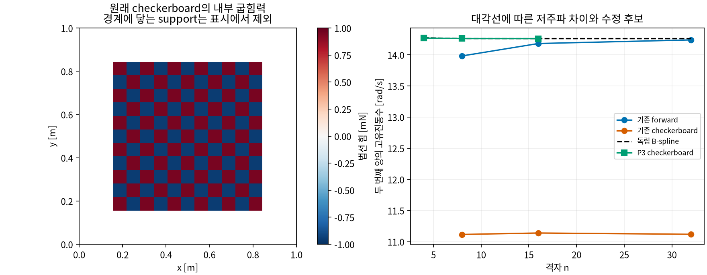
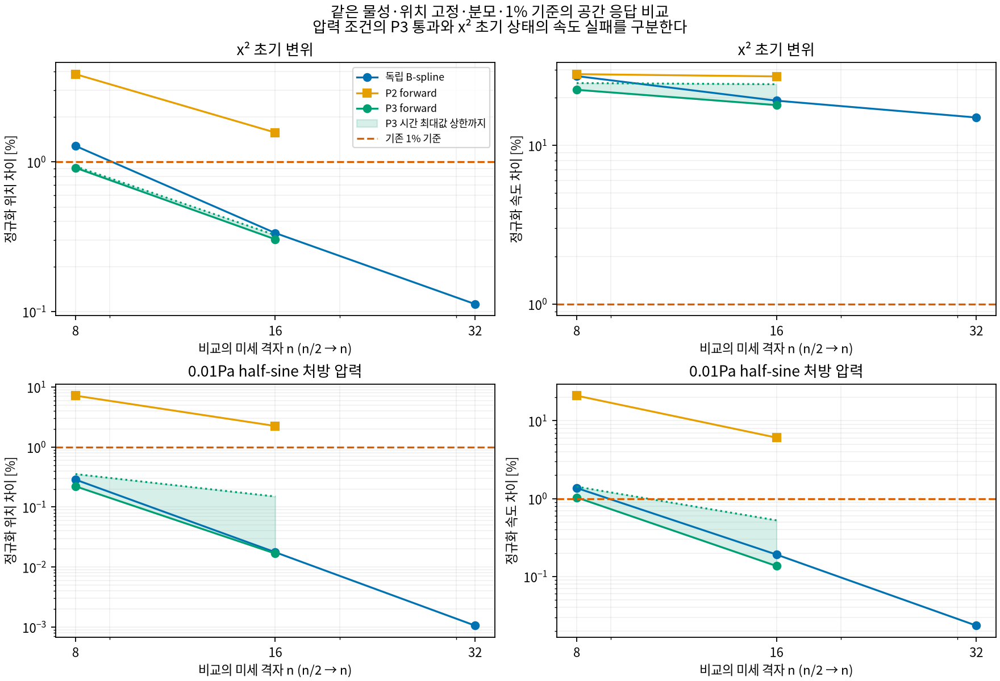

# Teacher 공간 수렴 보완

기존 [선형 공간 실패](../R1_teacher_shell_linear_spatial/README.md)를 보존하고, 내부 굽힘력 결함을
독립 C2 cubic B-spline 판과 P2 triangle C0 interior-penalty 판으로 대조한다.
[구현 계약과 검증](../../code/sessions/2026-09-08_07_teacher_spatial_remediation.md)을 따른다.

```bash
bash code/scripts/audit_teacher_plate_spatial_remediation.sh \
  --source-run ../experiments/artifacts/runs/teacher_shell_linear_spatial/20260908_reference_v1 \
  --output ../experiments/artifacts/runs/teacher_spatial_remediation/my_new_run
bash code/scripts/audit_teacher_plate_spatial_remediation.sh \
  --verify ../experiments/artifacts/runs/teacher_spatial_remediation/my_new_run
```

Launcher가 code로 이동하므로 인자는 code 기준이다. 1,800초 상한, 새 출력만 생성하고 실패/부분 출력은 보존한다.
`--verify`는 inventory·현재 source·gate 재계산이며 시계열 전수 재실행과 구분한다.
기존 x² 초기 변위와 추가 0.01Pa·0.2s half-sine 처방 압력을 같은 시각·분모·1% 기준에서 비교한다.
처방 압력을 실제 aerodynamic wind 입력으로 부르지 않는다. 모든 결과는 Teacher 적격성 false다.

두 구현 모두 같은 KL 에너지 밀도를 쓴다. B-spline은 H² conforming tensor basis를 직접 적분한다.
P2 내부 edge consistency/penalty 식은 [FEniCS-Shells 공식 KL 예제](https://fenics-shells.readthedocs.io/en/latest/demo/kirchhoff-love-clamped/demo_kirchhoff-love-clamped.py.html)를 참고했다.
해당 예제의 clamped 경계는 쓰지 않고, x=0 위치만 고정해 기울기 자유와 rigid 회전 1개를 보존한다.
SciPy는 기존 설치본을 사용하며 외부 code 다운로드·새 dependency 설치는 없다.

실행 결과·compact evidence·검산을 아래에 기록한다.

## 결과

**공간 의존성의 내부 힘 결함을 재현했고, P3 수정 후보는 부드러운 처방 압력 조건에서 1% 기준을 통과했다.**
기존 x² 초기 변위의 속도 검사는 여전히 실패다. 선형 판의 성공을 비선형 shell·실제 공력·학습 Teacher 채택으로 확대하지 않는다.

원래 checkerboard stencil은 n=8/16/32에서 같은 일정 곡률에 내부 정점 힘 약 0.00095238N을 남겼다.
원래 forward/backward는 roundoff 수준이었다. 경계에 닿는 support를 제외했으므로 경계 오차만으로 설명할 수 없다.
Ring 2/3/4 확대에도 잔여 힘이 남았고, lumped mass를 consistent mass로 바꿔도 낮은 고유진동수 차이가 남았다.
O(h²)의 내부 교대 변위로 에너지가 8.18% → 21.66% → 31.08% 줄어드는 반례도 재현했다.
Quadratic field의 에너지 값이 정확하다는 기존 검사만으로는 동적 수렴을 보장할 수 없었다.



P2 C0IP는 이 내부 힘을 roundoff 수준으로 줄였지만 응답 정확도가 부족했다. P3로 차수를 높여 추가 검증했다.
P3 triangle당 10 DOF, penalty=E*h³*(3/2)²를 실행 전에 고정했고, 모드 필터나 물성·입력·분모 조정은 하지 않았다.
P3 모델 9개와 독립 spline32를 두 입력 조건에서 모두 비교했다.

| 0.01Pa·0.2s half-sine 압력 조건 | 위치 차이 최대 [%] | 속도 차이 최대 [%] |
| --- | ---: | ---: |
| P2 n=8→16, 고정 시각 | 2.245875 | 6.079196 |
| P3 n=8→16, 고정 시각 | 0.016764 | 0.136376 |
| P3 n=8→16, **연속 시간 상한** | **0.149654** | **0.526612** |
| P3 n=16 대각선 간, 연속 시간 상한 | 0.133208 | 0.398941 |
| P3 n=16 ↔ spline32, 연속 시간 상한 | 0.134202 | 0.408232 |

세 대각선의 coarse→fine 오차 감소도 통과했다. 연속 시간 상한은 공통 시각 최대값에 전체 modal 속도/가속도
면적 RMS에서 얻은 Lipschitz 여유 `L*dt/2`를 더한 것이다. ω_max*dt가 π보다 커도 모드를 제거하지 않는다.
P3·spline의 연속 면적 norm은 공통 overlay의 충분한 차수 quadrature로 정확히 적분했다.
이는 유한 modal 모델 사이의 오차 상한이며 연속체 해까지의 전체 오차 증명은 아니다.



원래 x² 초기 변위에서는 P3 n=8→16 속도 차이가 17.59–17.93%, spline16→32도 14.98%로 남았다.
P3 위치 차이는 통과했지만 속도·방향·독립 기준 대조가 실패했다. 초기 상태는 유한 굽힘 에너지를 가지며
물리적으로 금지된 상태라는 뜻은 아니다. 높은 주파수까지 여기되는 응답의 수렴 문제가 남아 있다.
Spline32의 초기 굽힘 에너지 중 100rad/s 초과는 16.80%, 500rad/s 초과는 8.45%다.
[초기 modal 에너지](evidence/initial_spectral_energy.json)는 추가 진단이며 새로운 acceptance gate가 아니다.

## 검증과 재현

신규 27개와 기존 회귀 72개, 총 99개 검사가 통과했다. 연속체 다항식 energy/힘, 영모드·기울기 자유 경계,
simply-supported 판의 해석 주파수, 독립 matrix exponential, P3 기저 미분·회전·interpolation,
정확한 교차 적분, pressure 영모드/공진과 연속 시간 최대값 상한을 포함한다.
P3 전체 시각의 최대 자유진동 energy drift는 1.06844e-8, 처방 압력 work/energy 상대 차이는 1.58490e-7이다.
Work의 고정 시각 trapezoid 적분 오차가 포함되며 연속 적분의 exact equality로 표시하지 않는다.

원인/P2 run은 36개 stencil 진단, spline 4개와 P2 9개를 두 입력에서 비교했다.
P3 run은 P3 9개와 spline32의 두 입력을 비교했다. 각 model/조건은 10,241개 시각이며 모두 전체 모드를 쓴다.
각 run을 독립 재실행해 행렬·전체 비교 곡선·판정을 다시 계산했고, runtime.json 외 inventory byte가 일치했다.
원래 공간 실패 artifact의 1,509 inventory와 producer source 30개도 현재 checkout에 대해 검산했다.
[검산 결과](evidence/verification.json), [원인/P2 report](evidence/reference_report.json),
[P3 report](evidence/cubic_report.json), [provenance](provenance.json)를 보존한다.

```bash
bash code/scripts/audit_teacher_plate_cubic_refinement.sh \
  --source-run ../experiments/artifacts/runs/teacher_spatial_remediation/20260908_reference_v1 \
  --output ../experiments/artifacts/runs/teacher_spatial_remediation/my_cubic_run
bash code/scripts/audit_teacher_plate_cubic_refinement.sh \
  --verify ../experiments/artifacts/runs/teacher_spatial_remediation/my_cubic_run
OPENBLAS_NUM_THREADS=1 .venv/bin/python experiments/R1_teacher_spatial_remediation/evidence/verify_and_plot.py
```

Raw 경로는 `artifacts/runs/teacher_spatial_remediation/` 아래 `20260908_reference_v1`,
`20260908_reference_v1_replay`, `20260908_cubic_v1`, `20260908_cubic_v1_replay`다.
`--verify`는 inventory/source/gate 검산이다. 전체 물리 재계산은 위 독립 run 재실행으로 수행했다.
Ruff는 설치되지 않아 미실행했고 dependency를 추가하지 않았다. Plotting은 workspace-local Matplotlib cache를 사용한다.

다음 단계는 P3 기반 비선형 shell·consistent mass·공력/반력/work·10점 평가의 backend 계약과 구현,
실제 바람을 사용한 공간/시간 검증, sample producer 연결이다. 본 학습데이터의 초기 상태 범위는 사용자에게 질문했으며
답변 없이 기존 입력군을 제외하지 않는다. 기존 15개 Newton 샘플은 계속 development 전용이다.
실험 작성 시점에는 Code/experiments 변경이 미커밋이었고 Root/ideas는 변경하지 않았다.
후속 문서·Git 통합과 스케치 반영은 [2026-09-09 checkpoint](../sessions/2026-09-09_01_teacher_checkpoint.md)를 따른다.
