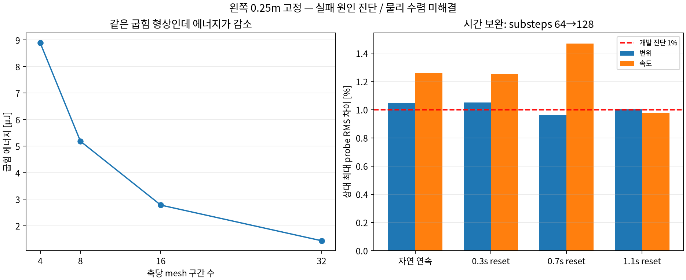

# 고정 폭을 유지한 velocity-reset과 패치 sample

이전 [pin-line 개발 비교](../README.md)의 후속이다. 사용자는 학습 sample 생성·검증까지 연속 진행하고,
작은 수정은 자율적으로 수행하되 주요 선택의 장단점을 질문하도록 요청했다.
제시한 고정 조건 중 **왼쪽0.25m 영역 고정**을 선택했다.

## 범위와 검증 질문

같은1m XZ flag에서 x<=0.25m 영역을 고정한다. Mesh4/8/16에서 경계가 정확히 일치하며 자유 길이는0.75m다.
원래 rest와 전체 질량0.1kg(고정부 포함), native 물성·바람·fps·horizon·reset 시점은 유지한다.
BC를 명시한 `wind3dgs.velocity_reset_development.v2`로 저장하고 기존v1 원본을 수정하지 않는다.
새 solver/물성 law, 모델 학습, GUI 또는 대규모 dataset은 추가하지 않는다.

**이 native source의 상태: 물리 수렴 미해결, dataset 미발행.** 사용자는 실패를 남긴 개발 sample로 끝내는 대신
**실패 원인을 분석·해결한 다음 학습데이터를 생성**하도록 선택했다. 아래 raw trace는 진단 자료다.
Exporter/loader는 임시 테스트 자료로만 검증했으며, 실제 학습용 sample 생성 완료를 뜻하지 않는다.
이후 사용자가 [기존 P3 활용](../p3_samples/README.md)을 선택했고 해당 작은 굽힘 범위의 검증을 통과하여
76개 sample을 생성했다. 여기의 native 실패 자료를 통과로 바꾸거나 sample source로 승격한 것은 아니다.

- 같은 고정 폭을 유지하고 실제로 비평면 굽힘 상태를 만드는가?
- 같은 backend에서 시간 간격·mesh 비교의 속도 차이가 충분히 줄어드는가?
- Reset을 가로지르거나 중복 prefix/replay를 넣지 않고 window·patch sample을 생성하는가?
- 절대 시각·wind·초기 상태·전역 work·patch 가중치·source group과 원본 배열이 정확히 연결되는가?

## 첫 실행 명령과 판정

Workspace root에서 실행한다. Launcher 인자는 code 기준이다.

```bash
bash code/scripts/check_teacher_velocity_reset.sh \
  --config ../experiments/R1_teacher_velocity_reset/clamped_samples/evidence/config_strip_initial.json \
  --output ../experiments/artifacts/runs/teacher_velocity_reset/20260909_strip_initial_v2
```

첫 비교는90 frame, fps60, checkpoint18/42/66, mesh4/8/16 at substeps32 및 mesh8 at substeps8/16/32다.
Seed20260909,12 frame마다 vector target 보간, 마지막18 frame ambient0/air drag 유지다.
1% paired probe 진단과 기존 수렴 실패를 유지한다. 본 학습용 acceptance를 이 비교만으로 승격하지 않는다.
실패를 포함한 실제 결과와 선택·보완 과정, sample 수와 재현 명령은 이 README에 누적한다.

## 첫 장애와 한정 보완

첫 strip 비교25 trace의 검산은 통과했으나 finest 자연 연속의 시간 속도 차이는29.46333%,
공간 속도는140.23369%였다. 굽힘 상태가 생긴 뒤 시간 오차까지 커졌으므로 공간 오차만으로 단정하지 않는다.
반복 횟수20 at substeps32, substeps64/128 at iterations10의 **자연 연속3개 trace**만 추가해
내부 반복과 시간 간격을 분리한다. 기존32/10 원본과 동일 wind/BC/material을 사용하고 baseline을 재활용한다.
1% 기준을 완화하지 않는다. 이 pilot은 dataset source가 아닌 보완 방향 진단이며 최대360초로 제한한다.

```bash
PYTHONPATH=code WARP_CACHE_PATH="$PWD/code/outputs/warp-cache" \
  OPENBLAS_NUM_THREADS=1 OMP_NUM_THREADS=1 .venv/bin/python \
  experiments/R1_teacher_velocity_reset/clamped_samples/evidence/run_temporal_pilot.py
```

추가 pilot은 자연 연속에서32→64의 속도 차이1.799880%,64→128은1.257692%였다.
32 substeps에서 iterations10→20은0.436875%로 영향이 더 작았다. 아직1%를 넘으므로 통과로 표시하지 않는다.
다음으로 동일한5×5 probe를 유지하면서 mesh8/substeps64·128의 원본/독립 replay/세 reset만 실행한다.
공통 probe 해상도를 simulation mesh와 분리해 불필요한 mesh4 재실행을 피한다. 기존v1/v2 검산은 유지한다.
이10 trace의 source에도 학습 적격성 false를 유지하고, 최초 spatial 실패를 삭제하지 않는다.

```bash
bash code/scripts/check_teacher_velocity_reset.sh \
  --config ../experiments/R1_teacher_velocity_reset/clamped_samples/evidence/config_strip_refined.json \
  --output ../experiments/artifacts/runs/teacher_velocity_reset/20260909_strip_refined_v2
```

## 시간 보완의 최종 결과

초기25 trace는 CPU320.758초, pilot3 trace는110.384초, 추가10 trace는372.303초다.
추가 실행의900 interval/910 state 모두 상태·공력·work·reset 검산을 통과했다.
같은25 probe에서 substeps64→128을 비교한 결과는 다음과 같다. 분모는 fine 분기의 해당 구간
최대 probe RMS 응답이며, reset은 checkpoint 이후 suffix만 비교한다.

| 분기 | 변위 차이 [%] | 속도 차이 [%] | 속도 절대 차이 [mm/s] | fine peak 속도 [mm/s] |
| --- | ---: | ---: | ---: | ---: |
| 자연 연속 | 1.045758 | 1.257692 | 0.232614 | 18.495303 |
| 0.3s reset | 1.050965 | 1.252818 | 0.218555 | 17.445073 |
| 0.7s reset | 0.959697 | 1.469637 | 0.261337 | 17.782454 |
| 1.1s reset | 1.005909 | 0.974783 | 0.179629 | 18.427539 |

각 분기는 변위와 속도가 모두1% 이하여야 하므로 **네 분기 모두 실패**다.
시간 오차는 줄었지만 통과하지 않았고, 추가 실행에는 spatial pair가 없다.
초기 공간 실패가 해결됐다고 해석하지 않는다. Float32가 원인이라는 가설도 이 결과만으로 확정하지 않는다.

## 공간 실패 원인의 분리

왼쪽0.25m 고정이 비평면 굽힘을 만들었는지 확인했다. 초기 mesh8/substeps32 자연 연속에서
최적 평면에 대한 전체25 probe의 면적 가중 RMS 잔차는0.3/0.7/1.1/1.5s에 각각
0.099051/0.034441/0.291320/0.214125mm였다. 이는 형상 진단이며 탄성 에너지의 비율이 아니다.

그 다음 같은 BC를 만족하는 해석적 형상 `delta_Y=0.001*(max(X-0.25,0)/0.75)^2` [m]을
각 mesh에 주고, native `edge_ke=10 N`의 굽힘 에너지만 float64 geometry로 계산했다.
기존 [native 감사](../../R1_teacher_bending_audit/README.md)의
`E_b=0.5*edge_ke*sum_internal(rest_edge_length*theta^2)`를 사용한다.
시간 적분·질량·감쇠·바람·solver iteration은 들어가지 않는다.

| n | 굽힘 에너지 [μJ] |
| --- | ---: |
| 4 | 8.888856504 |
| 8 | 5.185163554 |
| 16 | 2.777765415 |
| 32 | 1.435178592 |

같은 형상인데 n32 에너지가 n4의 약16.15%다. 독립 strip slope 해석식과의 차이는1e-12 이하로 검산한다.
따라서 native 물성의 격자 의존성은 현재 고정 조건에서도 남으며 시간 refinement만으로 해결할 수 없다.
단, 이 정적 계산이 전체 동역학 오차의 모든 기여율을 설명하지는 않는다.
기존 [면적 가중 보정](../../R1_teacher_bending_mapping/README.md)은 방향 편향으로 탈락했으므로
그 식을 조용히 재채택하거나 결과에 맞춰 계수·수렴 기준을 조절하지 않는다.



## 선택이 필요한 해결 범위

2026-09-09 다음 두 선택지와 장단점을 질문했고, 이후 사용자가 **1번 기존 P3 활용**을 선택했다.

1. 기존 P3 선형 판으로 **작은 굽힘**의 바람/reset sample을 구성한다. 기존 구조 코드와 압력 입력의
   공간 검증을 활용할 수 있지만, 큰 변형 대응의 증거가 아니다. 왼쪽0.25m 고정·actual relative wind·
   consistent mass·고차 probe map·reset과 force/work·새 시간/공간 비교는 다시 검증해야 한다.
2. Newton의 비선형 굽힘 구성·힘 계산을 보완한다. 큰 변형을 포함하려는 최종 목표와 연결되지만
   방향·해상도·미분·동역학 검증까지 필요해 이번 sample 범위를 확장한다. 별도 선택 없이 착수하지 않는다.

선택 전에는 물성식/backend를 변경하지 않았으며, 선택 후 별도 P3 adapter를 연결했다.
이전 실패 모델을 새 모델의 수렴 근거로 승계하지 않는다.

## 준비한 sample 경로와 검증

`code/wind3dgs/teacher/reset_patch_dataset.py`와 CLI/launcher는 development 전용으로 준비했다.
12 interval/13 state,25 probe에서4개의 겹치는3×3 patch를 추출한다. 겹침 면적을 분배하여 총면적1m²와
질량0.1kg을 보존하며, 전체 coupled context와 source group을 유지한다. 전역 aero work는 patch별로
복사하더라도 전체 물체 값이므로 patch에 걸쳐 합산하지 않는다. Teacher context는 target inference 입력이 아니다.
Natural 전체와 각 reset 이후 suffix만 사용하고, 중복 prefix/replay·개입 불연속·불완전 tail은 제외한다.
이 native90 frame 설정의 **계획상**19 window×4 patch=76 sample이며 native source의 실제 발행 수는0이다.

관련17개 단위 검사를10.979초에 통과했다. 임시 CPU trace에서 window 경계, 원본 대조,
개입 상태, 겹침 면적, batch shape, 재hash한 변조 거부와 선택적 Newton/Warp 의존성 분리를 확인했다.
이것은 물리 실패를 해결한 결과가 아니며 기존 exporter의 품질 false를 임의로 true로 바꾸지 않는다.

## 재현·보존

위 생성 명령은 실행 당시의 경로다. 재실행은 새 출력 경로를 써야 하며 기존 raw를 덮어쓰지 않는다.
원본은 ignored `artifacts/runs/teacher_velocity_reset/` 아래 initial/pilot/refined 세 폴더에 남아 있다.
선택 report/config/environment/manifest/log와 당시 producer source ZIP, 진단 JSON/PNG를
[evidence/](evidence/)에 보존했다. 초기 producer는25개, 추가 run은26개다.
추가 run의 source 목록에는 당시 존재한 dataset 모듈도 들어 있지만 그 실행에서 dataset을 만든 것은 아니다.
원본의 inventory와 현재 source는 구분하며, source 변경 후에는 ZIP의 hash로 당시 코드를 대조한다.
Raw NPZ는 ZIP에 포함하지 않으므로 clone만으로 복구되지 않는다.

```bash
PYTHONPATH=code OPENBLAS_NUM_THREADS=1 OMP_NUM_THREADS=1 .venv/bin/python \
  experiments/R1_teacher_velocity_reset/clamped_samples/evidence/diagnose_strip.py \
  --initial experiments/artifacts/runs/teacher_velocity_reset/20260909_strip_initial_v2 \
  --refined experiments/artifacts/runs/teacher_velocity_reset/20260909_strip_refined_v2 \
  --output /tmp/wind3dgs_strip_diagnosis_new
```

이 명령은 저장 trace/report 검산, 정적 해석식 대조와 figure 생성만 수행한다.
초기/추가 raw는 각각 manifest 제외55파일/5,039,317 byte와25파일/1,488,597 byte다.
Pilot은8파일/450,485 byte다. [provenance.json](provenance.json)에 선택 파일의 byte/hash를 기록한다.
CPU 로컬 환경만 사용했고 새 GPU 실행·설치·network fetch/download는 하지 않았다.
