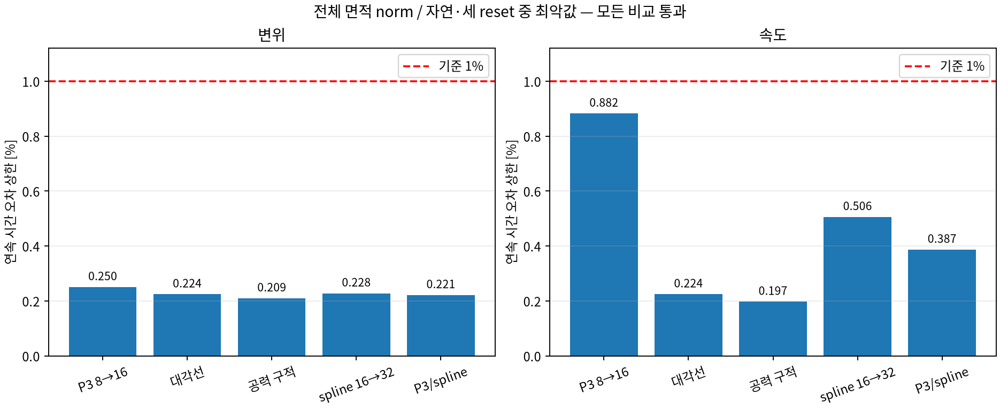
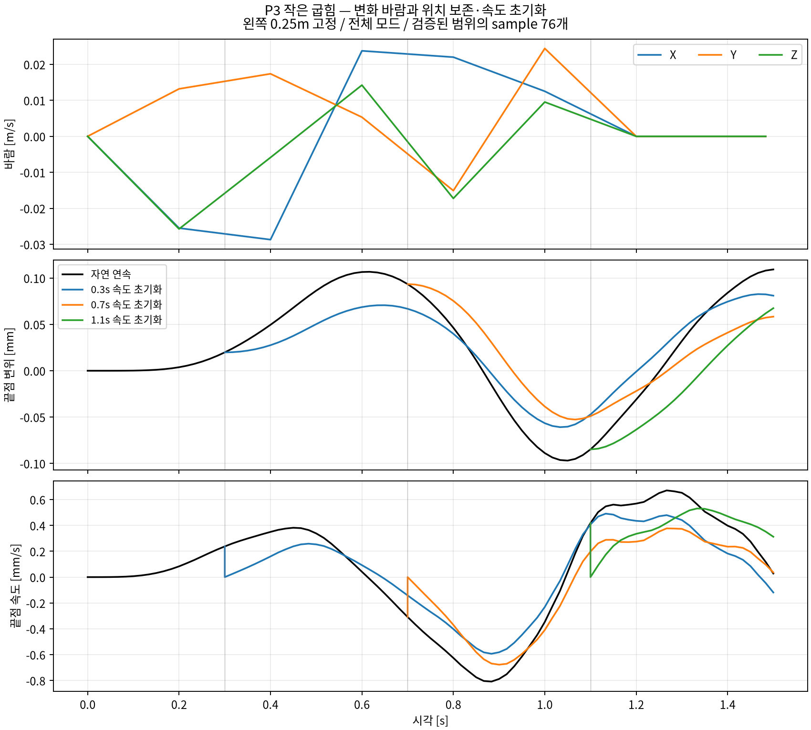

# P3 작은 굽힘의 변화 바람·속도 초기화 sample

**후속 지시:** 물리 수식 구현·검증 뒤에 학습데이터를 생성한다. 아래 76개는 이전에 생성한
작은 굽힘 개발 근거로 보존하며, 추가 발행은 보류한다.
현재 작업은 [P3 3D 요소의 수식 보완](../p3_surface/README.md)이다.

사용자는 기존 P3 활용을 선택했다. 이전 [native 고정 폭 실패](../clamped_samples/README.md)는 보존하고,
이번 작은 굽힘 조건의 물리 검증을 통과한 뒤 **19 window/76 patch sample을 생성·검증했다.**
이전 native 모델 자체를 고친 것은 아니며, 사용자가 선택한 P3 범위에서 수렴 문제를 해결했다.

## 동결할 조건과 변경 이유

- 1m XZ flag 중 왼쪽0.25m 영역 고정, 자유 길이0.75m. 기존 rest와 고정 폭을 유지한다.
- 기존 P3의 `E=1e6 Pa`, `nu=.3`, `h=.01m`, consistent mass와 면밀도0.1kg/m²를 사용한다.
  자유 영역 질량0.075kg/고정 영역0.025kg다. Native의10N hinge 계수와 동등한 재료라고 주장하지 않는다.
- 구조 감쇠는 기존 P3처럼0이다. 바람을0으로 바꿔도 정지 공기의 상대풍 drag는 유지한다.
- 기존 seed/90frame/60Hz/12frame vector target 보간/마지막18frame ambient0/
  checkpoint18,42,66을 유지한다. 작은 굽힘을 위해 target 풍속 상한을0.05m/s로 낮춘다.
  `|w|<=0.1h=1mm`, 기울기<=0.01을 검사하며 범위 초과를 조용히 clamp하지 않는다.
- 자유 영역의 P3를 재사용하고 x=.25의 변위0은 강하게, 기울기0은 weak boundary moment와
  기존 penalty factor2.25로 처리한다. 기존 position-only P3 source는 수정하지 않는다.
  [공식 FEniCS-Shells 경계식](https://fenics-shells.readthedocs.io/en/latest/demo/kirchhoff-love-clamped/demo_kirchhoff-love-clamped.py.html)의
  full boundary moment를 확인했다. 내부 edge의 half-average를 경계에 복사하지 않는다.
- 독립 spline은 같은 자유 사각형에서 open cubic의 첫 두 x coefficient를0으로 하여 변위·기울기를 고정한다.

## 공력·시간·sample 계약

`r(x,y)=(x,w(x,y),0.5-y)`의 current normal/area와 실제 상대풍에서 양면 normal traction을 계산한다.
Signed P3 shape의 transpose로 generalized force를 모으고 quadrature power와 일치시킨다.
고정 영역/면내 제약의 반력 몫과 움직이는 DOF의 force/work를 구분한다.
전체 모드를 제거하지 않은 exact oscillator로60Hz frame-start held force를 전진한다.
구조 내부1/2/4 분할과 독립 oscillator expm, consistent energy/work/reset ledger를 검산한다.
이 시간 검사는 force 평가 clock 자체를 연속 시간으로 수렴시켰다는 뜻이 아니다.

공간 mesh·대각선, force quadrature 차수, spline 자체 refinement 및 독립 spline 비교를 수행한다.
같은 backend/BC/load에서 전체 면적 norm과 시간 상한을 확인하며 기존 pressure 통과를 승계하지 않는다.
통과 뒤12 interval/13 state·4개3×3 patch를 추출한다. 원본/분기는 하나의 source group이고
중복 prefix/replay·reset 불연속·불완전 tail은 제외한다. 전역 work를 patch에 걸쳐 합산하지 않는다.

새 dependency·GPU·GUI·network training을 추가하지 않는다. 제한된 작은 굽힘 sample 적격성과
canonical R1/큰 변형 Teacher/3DGS oracle 채택은 별도다.

## 실제 결과와 해결 과정

1. Native에서 같은 굽힘 형상의 에너지가 격자에 따라 감소하던 문제를 기존 P3의 연속체 에너지와
   consistent mass로 대체했다. 이전 실패와 계수10N의 의미는 보존한다.
2. 기존 P3 pressure fixture는 위치만 고정하므로 그대로 쓰면 고정 폭 조건이 되지 않는다.
   자유 영역을 정확히0.75m로 두고, 경계에서 full moment를 쓰는 기울기 조건을 추가했다.
   독립 spline에는 별도로 강한 기울기 조건을 적용해 두 구현을 대조했다.
3. 선형 구조의 전체 모드를 exact 전진하여 내부 시간 적분 오차를 분리했다. 힘은 원래60Hz clock을
   유지하며 actual relative wind를 매 frame 재계산한다. Low-pass나 모드 제거로 속도 오차를 줄이지 않았다.
4. 작은 굽힘 범위를 frame/구적점에서만 검사하지 않고, P3 Bernstein 및 spline control point의
   convex hull과 전체 modal 진폭으로 **모든 요소 내부·held-force 구간의 모든 시간**에 대한 상한을 구했다.
5. 같은 조건의 격자·대각선·구적·독립 기준을 통과한 뒤 완전 재실행으로 원본을 검산하고 sample을 발행했다.

각 모델은 자연 연속과0.3/0.7/1.1s reset의 네 분기를 실행한다. P3 n4/n8/n16, n16 반대 대각선,
n16 Duffy6 공력, spline16/32의7개 모델이다. 추가 n16 내부2/4분할의8개 trace까지
각 최종 run은 **36 trace/3,240 interval/3,276 state**다.

다음 표는 네 분기 중 최악값이다. 면적 norm은 고정 영역의0응답을 포함한 전체1m²로 정규화한다.
분모는 같은 구간 fine의 sampled peak이며 reset은 개입 후 suffix다.
각60Hz 구간을128등분한 최대 차이에 두 모델의 velocity/acceleration Lipschitz 상한을 더한다.
따라서 표의 값은 frame 표본 차이만이 아니라 **연속 시간 상대 오차 상한**이다.

| 비교 | 변위 상한 [%] | 속도 상한 [%] | 판정 |
| --- | ---: | ---: | --- |
| P3 4→8 | 0.489434 | 1.423535 | coarse 진단 실패, sample source로 사용하지 않음 |
| **P3 8→16** | **0.250302** | **0.882329** | 통과 |
| P3 n16 대각선 | 0.224174 | 0.224285 | 통과 |
| 공력 Duffy4→6 | 0.209477 | 0.197062 | 통과 |
| 독립 spline16→32 | 0.227642 | 0.505603 | 통과 |
| P3 n16/spline32 | 0.221238 | 0.386575 | 통과 |

P3 공간의 끝점 sampled 속도 상대 차이도 네 분기 중 최대0.9408%로1% 이내다.
끝점은 별도의 sampled 진단이며 전체 면적 norm의 연속 시간 상한과 구분한다.
P3×P3의 교차 면적은 overlay/Duffy4, P3×tensor cubic은Duffy6,
spline×spline은Duffy8로 적분한다. Tensor의 축별 degree와 전체 degree를 혼동하지 않는다.
구적 비교가 아주 작아도 보수적 시간 상한의 여유가 더해지므로 표의 값이0이 되지는 않는다.



| 검산 | 결과 |
| --- | ---: |
| 구조 내부1/2/4분할의 최대 상대 차이 | 8.876e-15 |
| 독립 scipy expm, 전체 모드의 최대 energy-scaled 차이 | 1.248e-11 미만 |
| 실제 검사 지점 최대 변위 | 0.109697mm |
| 요소 내부·모든 시간 변위의 보수적 상한 | 0.421778mm 미만, 기준1mm |
| 모든 위치·시간 기울기 norm 상한 | 0.000791 미만, 기준0.01 |
| Exact modal step의 에너지/work 잔차 | 7.523e-24 J 미만 |
| 누적 work−reset ledger 잔차 | 3.309e-23 J 미만 |
| 직접 consistent M/K 이차형식과의 에너지 차이 | 3.763e-17 J 미만 |

마지막 직접 행렬 에너지 검산에는 큰 stiffness 항의 float64 상쇄 오차가 포함된다.
이를 modal ledger 잔차와 같은 수치로 보고하지 않는다. 고정부 displacement/velocity는0이다.
P3 n16의 세 reset에서 제거한 운동에너지는0.508396/0.878272/1.205717nJ이며 위치는 보존했다.
모든 분기가 이후 같은 미래 바람에 다시 움직였다. 1.5s 결과로 장기 안정성·학습 이득을 주장하지 않는다.



## 원본 실행·재실행과 보존

Workspace root에서 실행한다. 이 두 launcher의 상대 경로는 root 기준이다.
아래 경로는 실제 실행 기록이며, 재실행할 때는 새로운 output 이름을 사용한다.

```bash
bash code/scripts/check_teacher_p3_wind.sh \
  --output experiments/artifacts/runs/teacher_velocity_reset/20260909_p3_wind_verified_v1
bash code/scripts/check_teacher_p3_wind.sh \
  --output experiments/artifacts/runs/teacher_velocity_reset/20260909_p3_wind_replay_v1
bash code/scripts/check_teacher_p3_wind.sh \
  --verify experiments/artifacts/runs/teacher_velocity_reset/20260909_p3_wind_verified_v1 \
  --replay experiments/artifacts/runs/teacher_velocity_reset/20260909_p3_wind_replay_v1
```

| Raw run | CPU 경과 [s] | manifest 제외 inventory |
| --- | ---: | ---: |
| 20260909_p3_wind_initial_v1 | 77.781 | 54파일/167,584,586 byte |
| 20260909_p3_wind_verified_v1 | 91.145 | 54파일/167,594,035 byte |
| 20260909_p3_wind_replay_v1 | 91.445 | 54파일/167,594,035 byte |

Initial은 첫 수렴 비교이며 이후 continuous envelope/독립 expm/직접 ledger 검사42개를 더한
verified run을 최종 source로 썼다. Verified/replay는 **618개 배열/44,291,978개 scalar와 물리 report가 정확히 일치**한다.
위 `--verify` 단독은 파일/hash·기록된 판정의 검산이고 `--replay`를 함께 주면 별도로 생성한 전 배열/report도 대조한다.
Source manifest file SHA-256은 `6127bc9f4a895225b5c45de36dd337b18314d89c320d485194701ee2d17d69ef`다.

원본의 큰 NPZ는 ignored artifacts에 보존한다. Compact config/report/environment/manifest/log,
독립 재실행 결과, 그림과 actual producer ZIP은 [evidence/](evidence/)에 보존하고
[provenance.json](provenance.json)에서 byte/hash를 확인한다. Clone만으로 raw NPZ가 복원되지는 않는다.
기존 공식 FEniCS-Shells 페이지를 웹으로 확인했으며, Git fetch·dependency 설치/다운로드·새 GPU 실행은 없다.

## 생성된 sample과 읽기

실제 경로: `experiments/artifacts/datasets/teacher_p3_reset_samples/20260909_small_bending_v1/`.
Schema는 `wind3dgs.validated_p3_patch_sample.v1`, manifest 제외99파일/376,077 byte다.
자연 연속7개, reset0.3/0.7/1.1s 각각6/4/2개의 window로 **19 window×4 patch=76 sample**이다.
각 sample은12 interval/13 state·9 probe다. Natural 마지막6 interval만 불완전 tail로 제외했고,
분기 prefix와 replay를 중복 sample로 넣지 않았다. 각 reset 직전 interval은 해당 reset branch에서 제외한다.
네 patch를 합쳐 전체 면적1m²/label mass measure0.1kg을 보존한다. 이 measure는 구조 consistent M의 대체가 아니다.

```bash
bash code/scripts/generate_teacher_p3_samples.sh \
  --source experiments/artifacts/runs/teacher_velocity_reset/20260909_p3_wind_verified_v1 \
  --replay experiments/artifacts/runs/teacher_velocity_reset/20260909_p3_wind_replay_v1 \
  --output experiments/artifacts/datasets/teacher_p3_reset_samples/20260909_small_bending_v1
```

생성 후 별도 프로세스에서 위 `--output`을 `--verify`로 바꿔 원본 상태·wind·work·patch를 재검산했다.
Batch8의10개 batch(마지막4개), displacement/velocity shape `[8,13,9,3]`를 확인했다.
아래 읽기와 batching에는 NumPy만 필요하다.

```python
from wind3dgs.teacher.p3_patch_dataset import P3PatchDataset

dataset = P3PatchDataset.open(
    "experiments/artifacts/datasets/teacher_p3_reset_samples/20260909_small_bending_v1"
)
batch = next(dataset.iter_batches(batch_size=8))
print(batch["arrays"]["rest_displacements_m"].shape)  # (8, 13, 9, 3)
print(batch["arrays"]["initial_velocity_m_s"].shape)  # (8, 9, 3)
```

`sample_scope_eligible=true`는 이 고정 물성·BC·풍속/seed·60Hz 작은 굽힘 sample에 한정한다.
`canonical_training_eligible=false`, `r1_complete=false`, `target_runtime_input=false`다.
원본과 모든 분기를 같은 source group으로 유지하며 patch/window를 임의 train/test로 나눠 독립 사례로 세지 않는다.
큰 변형·새 object/seed·장기 wind·independent 3DGS·oracle·실제 student 학습 이득은 검증하지 않았다.
