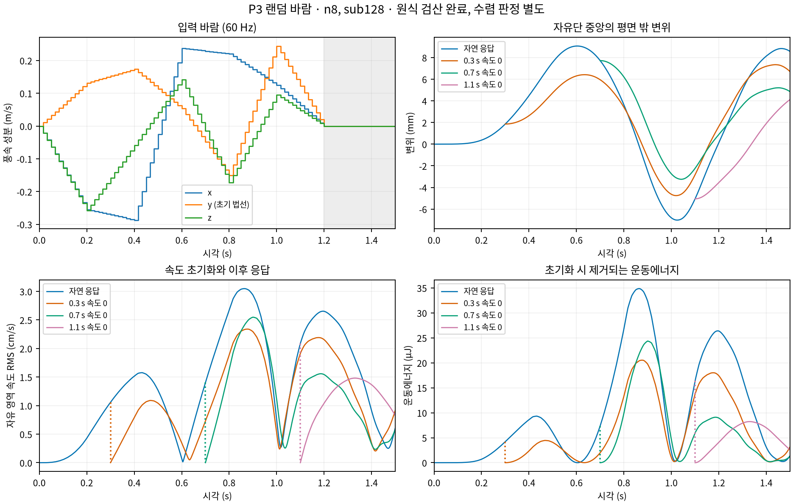

# P3 유한 회전 shell의 1.5초 랜덤 바람·속도 초기화 검증

사용자가 선택한 **기존0.25–0.5m/s부터 검증하고 결과에 따라 확대**를 적용한다.
[짧은 GPU 수식·수렴 검사](../p3_shell_gpu/README.md)의 Koiter/StVK 식, 재료, 지지 조건과
Newton/Newmark 허용오차를 그대로 사용한다. 추가 학습데이터는0개이며 R1 채택은 미완료다.

후속 사용자 승인에 따른 [4배 바람의1–3단계 검증](scale4/README.md)은 별도 원본으로 진행한다.
현재 실행기는 배율을 명시하는 chunk schema v2이며, 아래 완료된 약한 바람 schema v1은
runtime v4와 실험 wrapper v1의 격리된 source로 재현한다. 기존 원본·검산·snapshot은 그대로 보존한다.

## 고정된 실험 조건

기존 `VelocityResetSpec`/`make_wind_program`의 seed20260909, PCG64,60fps,90 frame을 사용한다.
12 frame 간격의 방향·속도 knot 사이를 벡터 선형 보간한다. Knot 목표 속도는0.25–0.5m/s이며,
보간된 실제 속도는 이 하한보다 작을 수 있다. 첫/마지막 target은0이고 마지막18 frame은
외부 바람0이다. 이때에도 움직임에 대한 상대풍 drag는 남는다.

Rest에서 출발하는 natural90 frame과18·42·66 frame의 원래 변형 상태에서 각각 속도만0으로
초기화한 독립 분기를 비교한다. 분기는 같은 전역 시각의 이후 바람을 사용한다.
Natural prefix를 반복 계산하지 않고, 완결된 원본 checkpoint를 정확히 읽어 suffix72/48/24 frame을
계산한다. Parent의 manifest SHA와 같은 material/grid/source/wind identity를 요구한다.
위치·시각을 보존하고 consistent-mass kinetic energy만 제거하며 제거량을 별도로 저장한다.

첫 전진은 n8/sub128로 시작하고, 원식 검산 후 공간·시간 세분 및 방향 비교를 진행한다.
낮은 격자의 완료를 물리 수렴 통과로 간주하지 않는다. 수렴 기준은 기존1%를 유지한다.

## 저장·검산과 실행

`teacher_p3_shell_random.py`는 force를60Hz frame 시작에서 평가해 그 frame의 모든 substep에서
유지한다. Frame마다 u/v/time, held force, work, energy balance와 지지 모멘트의 NPZ 및
step diagnostics JSON을 저장한다. 모든 배열을 한꺼번에 메모리에 올리지 않는다.
Worker 실패 시 이미 완료된 frame을 보존하고 실패 report/console/manifest를 남긴다.
중간 실패 run을 완결된 parent로 사용하거나 기존 원본을 덮어쓰지 않는다.

```bash
bash code/scripts/check_teacher_p3_shell_random.sh --resolution 8 --substeps 128 --output experiments/artifacts/runs/teacher_p3_shell_random/natural_m8_s128
bash code/scripts/check_teacher_p3_shell_random.sh --resolution 8 --substeps 128 --parent experiments/artifacts/runs/teacher_p3_shell_random/natural_m8_s128 --checkpoint 42 --output experiments/artifacts/runs/teacher_p3_shell_random/reset42_m8_s128
PYTHONPATH=code OPENBLAS_NUM_THREADS=1 OMP_NUM_THREADS=1 .venv/bin/python -m wind3dgs.evaluation.teacher_p3_shell_random_validation experiments/artifacts/runs/teacher_p3_shell_random/natural_m8_s128 --device cuda:0 --output experiments/artifacts/runs/teacher_p3_shell_random/verification/natural_m8_s128.json
```

검산은 실제 evaluator를 명시한다. CPU mode는 모든 상태의 원식을 NumPy로 다시 계산한다.
CUDA mode는 모든 interval의 원식을 CUDA로 재계산하고 frame별 시작·중간·끝3개 상태의
energy/force/geometry/support couple를 NumPy로 추가 대조한다. 공력도 frame마다 CPU 대조한다.
CUDA 검산을 전 상태 CPU 검산으로 소개하지 않는다.
두 방식 모두 Newmark 잔차, 위치 update, 고정점, 전체 clock, 에너지 장부·reset 및
P3/Newmark 구간의 Bernstein 기하 상한을 확인한다. 이는 정확한 연속 ODE 인증이 아니다.

`--replay-checkpoint --parent ... --checkpoint 42 --end-frame 43`은 속도를 유지한 재시작이다.
원본43번째 frame과 배열·diagnostics를 비교해 checkpoint 저장이 상태를 바꾸지 않았는지 확인한다.
Parent와 분기는 같은 결과 폴더 아래에 두며 개인 절대 경로를 기록하지 않는다.
새 source26개는 run별 ZIP으로 동결한다. 물리식과 단기 GPU source22개는 이전 원본과 동일하다.

원본은 ignored `experiments/artifacts/runs/teacher_p3_shell_random/` 아래에 두고,
검산 결과와 작은 report·manifest·source snapshot만 이 폴더의 evidence에 선별 보존한다.
완결된 긴 실행의 실제 결과와 문제·조치는 아래에 보존한다.

## 첫1.5초 결과와 재시작

N8/sub128 natural은639.729s, n16/sub128 natural은847.078s에 완료했다.
두 natural 원본은 각각11,520 interval을 원식으로 검산했다. CUDA 전 interval 검산에 더해
270개 frame-local CPU 상태 대조와90개 공력 대조를 수행했다. 인접 frame 끝점의 중복을 포함한 수다.
아래 n8 결과는 각 reset 이후 suffix의 최대값이며 공통 prefix는 natural에 있다.

| n8/sub128 원본 | 검산 interval | 제거 kinetic (µJ) | 최대 nodal 변위 (mm) | 힘 잔차/허용오차 최대 |
|---|---:|---:|---:|---:|
| natural | 11,520 | 0 | 9.064782 | .00950742 |
| reset18 (0.3 s 이후) | 9,216 | 4.196144 | 7.340188 | .00815724 |
| reset42 (0.7 s 이후) | 6,144 | 7.372056 | 7.718421 | .00789162 |
| reset66 (1.1 s 이후) | 3,072 | 16.385619 | 5.051576 | .00814031 |

네 원본의29,952 interval 모두 Bernstein 단사성 충분조건을 만족했다.
Natural의 projected gradient 상한.000146414, area ratio 하한.999707194,
mid-surface strain 상한3.995235e-6, 선형 표면 strain 상한.000309555였다.
마지막18 frame zero ambient의 누적 외력 일은−1.380223µJ로 순 에너지를 제거했다.
구간별 힘·Newmark·일·에너지 장부·reset·고정 조건의 검산은 통과했고, 수렴은 별도 비교한다.

N8/n16 checkpoint42의 무초기화 재시작은 각각9개 배열/369,848 scalar와
9개 배열/1,409,474 scalar 및 모든 step diagnostics가 정확히 같았다.
격리 source에서도 n8의 같은 checkpoint를 실제 CUDA로 재시작해 동일9개 배열/369,848 scalar를
확인하고 원식을 검산했다. Parent의 저장 상태로부터 같은 바람을 재평가한 결과다.



그림은 실제 저장 substep을 사용한다. 속도 RMS는 자유0.75m² 평균이며,
개입의 점선은 같은 시각에서 제거되는 속도·kinetic이다. 유한 회전 law의 수식 개발 근거이며
큰 변형의 충분성이나 공간·시간 수렴 완료를 이 그림만으로 판정하지 않는다.

## 수렴 비교와 RMS 정규화 영역

아래 다섯 조건에서 각각 natural과 세 reset을 완료했다: n8/sub128, n16/sub128,
n8/sub256, n16/sub256 forward 및 backward. 총20개 물리 원본의239,616 interval을 검산했다.
CUDA의 전 interval 검산에 더해1,170개 frame마다 CPU3상태 및 공력을 대조했다
(상태 대조3,510회; frame 경계 중복 포함). 추가 checkpoint5개, 격리 재시작 및 smoke는 이 합계에 포함하지 않는다.

각 원본의 manifest/source/검산과 비교의 입력 해시를 연결한 최종 결과는
[`evidence/verification/final_summary_v1.json`](evidence/verification/final_summary_v1.json)에 있다.
아래는 **전체 수치 보간의 속도 상대 상한(%)**이다. 다섯 비교×네 분기20개 모두 기존1%를 통과했다.

| 비교 | Natural | Reset 0.3 s | Reset 0.7 s | Reset 1.1 s |
|---|---:|---:|---:|---:|
| 공간 n8→16 / sub128 | 0.699080 | 0.910953 | 0.848095 | 0.720628 |
| 공간 n8→16 / sub256 | 0.694414 | 0.904299 | 0.842757 | 0.711993 |
| 시간 sub128→256 / n8 | 0.108164 | 0.136703 | 0.119953 | 0.169299 |
| 시간 sub128→256 / n16 | 0.096664 | 0.119147 | 0.096074 | 0.148473 |
| 방향 forward↔backward / n16, sub256 | 0.044940 | 0.055049 | 0.045901 | 0.063805 |

동일20개 비교의 변위 최대 상한은0.071417%, 각 분기 시작 상태 대비 변위 증분은0.072494%다.
공간 비교가1%에 가까워 시간 오차와의 혼동을 확인하려고 n8/sub256을 추가했다.
최대 공간 속도 차이는 sub128의0.910953%에서 sub256의0.904299%로 비슷하게 유지됐다.
이에 이번 약한 바람 범위에서는 n32 장시간 실행을 추가하지 않았다. 독립 공간 기준의 통과는 별도다.


초기 비교를 점검하면서 `RMS` 이름을 면적 정규화 누락으로 해석했으나,
선행 CPU README의 **고정 영역을 포함한 전체1m² 평균** 정의를 확인해 그 해석을 철회했다.
이는 수식 오류가 아니다. 새 비교 law v2는 **자유0.75m² 평균**을 JSON에 명시한다.
자유 영역 RMS는 전체 영역 RMS의1/sqrt(.75)배이며 상대 오차는 같다.
실제90 frame의 구/신 보고서에서 이 변환과 동일한 상대 상한을 확인했다.

정규화 영역을 명시하는 동안 비교 wrapper3개만 제어 중단했다. 해당 v1 묶음의
`status=failed`/`KeyboardInterrupt`는 물리 solver 실패가 아니다. 전진·원식 검산은 계속 유지했다.
V1 결과를 보존하고 v2 폴더에서 비교를 다시 수행했다.
새 상수 벡터장 RMS 검사와 다항식·공간 overlay·시간 보간 검사4개가.349s에 통과했다.
검사 추가 중 기존 다항식 assertion을 잘못된 함수에 넣은 NameError를 바로잡은 로그도 보존한다.
수식 producer26개, 원본 상태, solver tolerance와1% 기준은 바꾸지 않았다.

## 재현 묶음

`evidence/p3_shell_random_runtime_v1.zip`은 실제 import 주변 파일까지 포함한46개 project source다.
V2는 현재 mapper/검산 source와 producer의 identity 확인을 추가한다.
V3는 비교 law v2의 자유 영역 RMS 명시와 대응 테스트를 반영한다.
모든 버전에서 전진·원식 검산 producer26개는 동일하며 제3자 dependency는 포함하지 않는다.
각 ZIP의46개 member SHA와 producer26개는 대응 `runtime_manifest_v*.json`에 있다.
아래 약한 바람 비교의 재현에는 v3/v4를 사용하고 v1/v2를 소급 덮어쓰지 않는다.
V4는 위46개를 유지하고 선택 상태의 구적 대조 모듈1개를 더한47개 source다.

`verify_development_evidence.py`는 natural 완료 후 원식 검산→checkpoint 재시작→세 reset 전진·검산을,
`compare_development_evidence.py`는 동일 분기의 완료 후 수치 보간 비교를 수행하는 실험 wrapper다.
그림은 `render_development_evidence.py`로 만들며 run/verification/wrapper 해시를 함께 저장한다.
Matplotlib cache 접근 경고가 있었으나 임시 cache에서 PNG/PDF 생성은 성공했다.
후속 실행은 `MPLCONFIGDIR`를 workspace의 쓰기 가능한 cache로 명시한다.

## 현재 변형 상태의 구적 대조

N16/sub256 natural의0.3/0.7/1.1/1.5초와 최대 nodal 변위 시각0.603385417초의5개 상태를 골랐다.
동일 좌표를 CPU volume/edge6/4와10/8로 평가했다. Energy 상대 차이는 최대5.05927e-12%,
탄성력 mass-dual 상대 차이는.00000742146%, 움직이는 상태의 공력은.000185059%였다.
같은 위치에서 속도만0으로 둔 공력 차이는2.02035e-13% 이하였다.
모두 기존1% 아래이며 구적의 영향과 mesh/time 차이를 분리한 진단이다.
선택 상태 검사를 전체 시각의 구적 인증이나 독립 공간 기준의 통과로 소개하지 않는다.
`teacher_p3_shell_random_quadrature` CLI가 실제 frame/substep/manifest/검산/source 해시와 결과를 저장한다.

## 최종 finest 응답과 적절성 판정


| n16/sub256 forward | 최대 nodal 변위 (mm) | 제거 kinetic (µJ) | 마지막0.3 s 외력 일 (µJ) |
|---|---:|---:|---:|
| natural | 9.067314 | 0.000000 | -1.378833 |
| reset18 | 7.337294 | 4.196988 | -0.576277 |
| reset42 | 7.722647 | 7.363604 | -0.227986 |
| reset66 | 5.052599 | 16.355723 | -0.449933 |

Finest natural의 면적비 하한은0.999710027, mid-surface strain 성분 상한은
3.58088677e-06, 선형 표면 strain 성분 상한은0.000308814685다.
20개 원본 모두 수치 P3/Newmark 보간의 Bernstein 단사성 충분조건을 만족했다.
전체 힘 잔차/동결 허용오차의 최대 비는0.023813553다.
마지막 zero-ambient 구간의 외력 일은20개 원본에서 모두 음수였으며 상대풍 drag가 순 에너지를 제거했다.

모든 조건의 checkpoint42 무초기화 재시작은9개 배열과 step diagnostics가 정확히 같았다.
Sub256의 n8/n16 비교 scalar 수는 각각735,416/2,802,626개다.
위치·시각을 유지한 velocity-reset은 개입 에너지를 따로 기록하고, 이후 동일 미래 바람에 대한 분기 응답을 만든다.
Reset을 가로지르는 window를 일반적인 연속 바람 응답 label로 섞어서는 안 된다.

이번 검증은 **도달한 형상에서 속도만0으로 둔 뒤 계속 전진하는 절차가 약한 바람 범위에서 수치적으로 성립함**을
뒷받침한다. 최대 nodal 변위는 약9.07mm여서 큰 변형의 장시간 coverage는 확보하지 못했다.
풍속 확대는 다음 사용자 결정이며, 현재 law의 독립 비선형 공간 기준, 재료 허용 strain의 채택,
고정 영역 외력 모멘트 장부·공개 Registry/고차 GS/probe/oracle 연결도 남는다.
`development_checks_passed=true`와 `training_eligible=false`, `r1_complete=false`를 함께 유지한다.
추가 학습데이터는0개이며 기존 작은 굽힘76개 sample을 새 law의 근거로 승격하지 않았다.

최종 작은 원본·검산 파일 목록과 SHA는 `evidence/inventory_v1.json`에 있다.
원본 NPZ는 ignored raw에 보존하며 runtime v4의47개 project source와 producer26개 identity는 그대로다.
최종 요약은 `evidence/aggregate_random_v1.py`, 선별 보존은 `evidence/collect_random_v1.py`로 재현한다.
그림 provenance는 실제 원본/검산 해시와 그리는 wrapper 해시를 보존한다.

```bash
mkdir code/outputs/p3_shell_random_recheck_v4 code/outputs/p3_shell_random_wrappers_v1
.venv/bin/python -m zipfile -e experiments/R1_teacher_velocity_reset/p3_shell_random/evidence/p3_shell_random_runtime_v4.zip code/outputs/p3_shell_random_recheck_v4
.venv/bin/python -m zipfile -e experiments/R1_teacher_velocity_reset/p3_shell_random/evidence/p3_shell_random_experiment_wrappers_v1.zip code/outputs/p3_shell_random_wrappers_v1
PYTHONPATH=code/outputs/p3_shell_random_recheck_v4 OPENBLAS_NUM_THREADS=1 OMP_NUM_THREADS=1 .venv/bin/python experiments/R1_teacher_velocity_reset/p3_shell_random/evidence/aggregate_random_v1.py --output experiments/artifacts/runs/teacher_p3_shell_random/verification/final_summary_recheck.json
PYTHONPATH=code/outputs/p3_shell_random_recheck_v4 OPENBLAS_NUM_THREADS=1 OMP_NUM_THREADS=1 MPLCONFIGDIR=code/outputs/matplotlib-cache .venv/bin/python code/outputs/p3_shell_random_wrappers_v1/render_development_evidence.py experiments/artifacts/runs/teacher_p3_shell_random/20260909_natural_m16_s256_v1 --verification experiments/artifacts/runs/teacher_p3_shell_random/verification/natural_m16_s256_v1 --output experiments/R1_teacher_velocity_reset/p3_shell_random/figures_recheck
```

새 출력 경로가 필요하며 기존 결과는 덮어쓰지 않는다. 재현 시 실행 환경은 `evidence/environment_v1.json`을 따른다.
