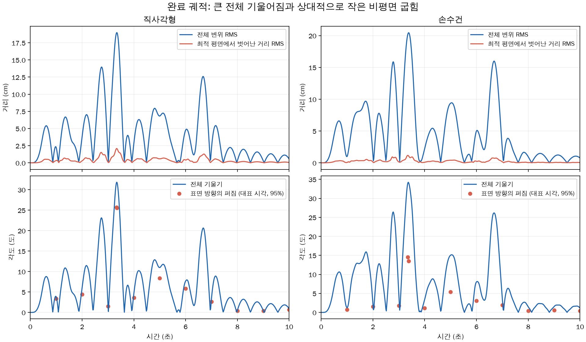

# 완료 궤적의 판 같은 움직임 분석

## 현재 상태 — 2026-09-13

**저장된 두 씬은 큰 전체 기울어짐과 상대적으로 작은 비평면 굽힘이 지배한다.**
특히 손수건은 고정부 근처에 굽힘이 집중된다. 뷰어의 인상과 일치하는 형상 통계를 확인했지만,
물성·경계·바람·수치 오차의 개별 인과 기여율은 이 두 궤적만으로 분리하지 않았다.
새 시뮬레이션·물성/솔버/원본 변경 없이 완료 궤적과 대표 상태를 분석했다.



## 실제 움직임

각 씬의 면적 가중 변위 RMS가 최대인 시각을 비교했다. RMS는 표면 전체의 대표 크기이며 최댓값과 다르다.

| 항목 | 직사각형 | 손수건 |
| --- | ---: | ---: |
| 대표 시각 | 3.350초 | 3.383초 |
| 전체 변위 RMS | 18.97cm | 20.46cm |
| 해당 시각 최대 정점 변위 | 38.42cm | 38.81cm |
| 최적 평면에서 벗어난 거리 RMS | 2.07cm | 1.06cm |
| 기준 평면 대비 전체 기울기 | 31.78도 | 34.05도 |
| 최적 강체 회전·이동 후 남는 RMS | 2.10cm | 1.06cm |
| 고정부 근처 면적 비율 | 16.67% | 5.50% |
| 그 영역의 내부 굽힘 에너지 비율 | 45.66% | 63.58% |

고정부 근처는 rest에서 고정 P3점까지의 거리가 rest AABB 대각선의10% 이하인 영역이다.
거리 한도는 직사각형0.125m, 손수건0.098995m다. 내부 굽힘 에너지만 공간 분포에 사용했다.
손수건의 작은 부착부 주변이 많이 휘고 넓은 몸체는 비교적 비슷한 방향을 유지하는 형태다.

강체 맞춤은 기준 형상을 자유롭게 회전·이동시켜 실제 표면에 가장 가깝게 놓는 기하 진단이다.
그 맞춤 자체가 고정점 조건을 만족하는 물리 운동은 아니다. 완전한 강체라고 판정하지 않는다.
최대 변위5cm 이상인601개 저장 시각 중 직사각형306개·손수건313개에서,
잔차 제곱/전체 변위 제곱의 중앙값은 각각0.00919·0.00233이었다.
이를 물리 모드의 에너지 비율 또는 분산 설명률로 부르지 않는다.
대표 상태의 표면 방향 퍼짐95% 값도25.57도·13.47도로, 실제 굽힘이 존재한다.

## 현재 조건이 주는 해석

1. **초기 처짐 없음:** 실행기는 평면 rest에서 시작하고 외력으로 공력만 전달한다. 중력이나 중력에 의한 초기 안정화가 없다. 따라서 매달린 천의 기본 처짐을 기대하는 장면과 조건이 다르다.
2. **공통 셸 물성:** E=1MPa, ν=0.3, 강성 산정 두께h=0.01m, 면밀도0.1kg/m²다. 실제 모델의 막 계수는10989.01N/m, 굽힘 계수는0.091575N·m이다. 두께는 굽힘 강성 계산에 세제곱으로 들어가지만 특정 실제 직물에 맞춘 보정은 없다. 면밀도는 독립 설정이므로 이를 문자 그대로의1cm 두께 고체 재료로 단정하지 않는다.
3. **고정부 회전도 제한:** 직사각형은 한 변, 손수건은 두 모서리의 작은 고정 패치다. 고정 외곽 변은 rest 법선까지 제한한다. 대표 시점의 굽힘 집중은 이 부착 조건과 일관된다.
4. **공간적으로 같은 바람:** 풍향·풍속은 시간에 따라 달라지지만 한 프레임의 공간 입력은 벡터 하나다. 최대 풍속1.988m/s, RMS1.056m/s이며 국소 이동 돌풍·유체 와류·상호 유체해석을 포함하지 않는다. 다만 실제 공력은 각 표면의 현재 법선·상대속도에 따라 달라진다.
5. **감쇠 구분:** 구조 감쇠는0이며 상대 공기저항은 존재한다. 따라서 높은 구조 감쇠 때문에 잔주름이 사라졌다고 설명할 수 없다. 시간 적분의 실제 정확도는 별도 미검증이다.

## 수치 굽힘 연결이 과도한가?

대표 최대 변위 시점의 내부 굽힘 에너지는 직사각형0.049784J, 손수건0.022986J다.
면 연결 에너지 합은 각각2.13e-7J·7.86e-4J로 내부 굽힘 대비 약0.00043%·3.42%다.
상쇄를 확인하기 위해 양의 penalty 항도 따로 계산했으며 내부 굽힘 대비 약0.00547%·2.07%다.
따라서 이 대표 상태의 저장 에너지가 수치 penalty에 지배된다는 증거는 없다.

에너지 크기만으로 강성 오차·잠김(locking)·고주파 모드·해상도 의존성을 배제할 수는 없다.
penalty 변경·격자 세분·시간 세분 비교를 하지 않았으므로 수치 원인을 완전히 배제하지 않는다.
옛 삼각 깃발의 음의 강성 문제를 이번 두 씬의 원인으로 자동 승계하지 않는다.
검사한 대표24상태의 전체 탄성 에너지는 모두 양수다. 전체 궤적 양정성 증명은 아니다.

## 뷰어가 움직임을 없앴는가?

전체 형상 통계는 이전에 원본600개 trace SHA256을 확인한 표시 캐시를 사용했다.
이번 분석에서 캐시 파일 hash와 원본 report hash를 다시 확인했다. 표시 float32 오차는6e-8m 미만이다.
각 씬12개 대표 시각을 원본 hi/lo에서 다시 읽어 표시 위치와1e-7m 이내 일치함을 확인하고
힘을 적분하지 않은 정적 에너지·법선·곡률 분석을 수행했다.
대표24프레임 내부64단계가 양 끝 상태의 선형 보간에서 벗어나는 최대 정점 거리는
직사각형0.806mm 미만·손수건0.786mm 미만이었다. 이는 이 구간에 큰 내부 움직임이
숨겨졌다는 증거가 없다는 뜻이며 전체 궤적의60Hz 표본화 적합성 판정은 아니다.
캐시는 학습 데이터나 물리 수렴 오차 판정에 사용하지 않았다.

## 재현·검증·한계

- 대상: `experiments/artifacts/runs/teacher_timestep_search/20260912_three_scenes_10s_v4`의 완료된 두 씬.
- [직사각형 결과](reference_rectangle.json), [손수건 결과](handkerchief.json): 원본 hash,601시각 형상 통계와 각12개 대표 원본 상태 정적 결과.
- [분석 코드](analyze.py), [그림 코드](plot.py). 모델은 동결 runtime에서 불러오며 원본 manifest를 검증한다.
- 형상 맞춤 가중치는 consistent mass의 행 합을 정규화한 양의 P3 절점 가중치다. 물성이 균일하므로 면적 가중의 절점 구적 진단이며 연속 곡면 제곱오차의 정확 적분은 아니다.
- 대표 에너지 구성 합·기하 잔차 관계·샘플 수·finite 상태를 검사했다. 원본 조건을 바꾼 비교 실험·전체 CPU 물리 재검산·수렴 검증은 하지 않았다.
- 외부 웹조회·fetch·다운로드 없음. 기존 실행·코드·설정 변경 없음. 이번 결과는 학습 발행 보류나 연구 Gate를 해제하지 않는다.

Workspace root에서 두 분석은 서로 독립된 CPU1스레드 작업으로 실행할 수 있다.

```bash
PYTHONPATH=experiments/artifacts/runs/teacher_timestep_search/20260912_three_scenes_10s_v4/runtime/code OPENBLAS_NUM_THREADS=1 OMP_NUM_THREADS=1 .venv/bin/python experiments/R1_teacher_velocity_reset/timestep_search/evidence/cloth_motion_20260913/analyze.py reference_rectangle
PYTHONPATH=experiments/artifacts/runs/teacher_timestep_search/20260912_three_scenes_10s_v4/runtime/code OPENBLAS_NUM_THREADS=1 OMP_NUM_THREADS=1 .venv/bin/python experiments/R1_teacher_velocity_reset/timestep_search/evidence/cloth_motion_20260913/analyze.py handkerchief
MPLCONFIGDIR=/tmp/wind_motion_matplotlib .venv/bin/python experiments/R1_teacher_velocity_reset/timestep_search/evidence/cloth_motion_20260913/plot.py
```
