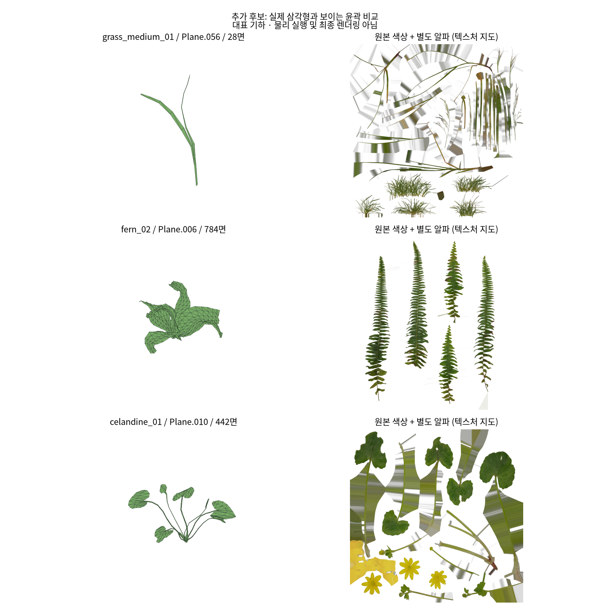

# 추가 후보 5개 구조 검토

## 현재 상태 — 2026-09-12

Grass·Fern·Celandine의 공개 4K glTF와 BIN·텍스처를 새로 다운로드하고
배포 크기/MD5 및 SHA256을 검산했다. Skirt는 앞선 저장 결과를 재사용했다.
Monstera는 공식 다운로드 페이지가 로그인 화면을 반환하여 원본 미확보다.
물리 시뮬레이션·학습 적격성·실제 렌더링 검증은 하지 않았다.

**후속 우선 후보는 Grass의 작은 구성과 Skirt다. Fern은 기하 재구성 비용 때문에 후순위다.**
Skirt도 현행 평면 rest 입력에 바로 연결할 수 없으며 봉제 원단 처리가 필요하다.

| 후보 | 실제 파일의 삼각형 / 메시 / 연결 조각 | 판정과 필요한 보완 |
| --- | --- | --- |
| [Grass Medium 01](https://polyhaven.com/a/grass_medium_01) | 24,730 / 17 / 1,099 | 조건부 우선. 작은 구성 Plane.056은 28면·1조각, Plane.059는 60면·1조각. 긴 띠형 표면을 추출하고 윤곽·곡면 rest·밑동 고정을 준비. 원본은 계산용 해상도 수렴을 보장하지 않음 |
| [Fern 02](https://polyhaven.com/a/fern_02) | 6,232 / 4 / 53 | 후순위. 메시별 약 50.9–52.1% 면적이 알파로 가려짐. 세밀한 깃털 윤곽을 실제 기하로 재구성하지 않으면 기대한 형상 다양성을 물리적으로 확보하기 어려움 |
| [Monstera Plant — Simon_M](https://blendswap.com/blend/27517) | 미확인 | 다운로드 페이지 HTTP 200이지만 Sign in to download 요구. 공개 페이지상 CC0이나 메시·텍스처 해상도·구멍 구조를 검사하지 못함 |
| [Celandine 01](https://polyhaven.com/a/celandine_01) | 8,966 / 5 / 338 | 조건부. 작은 구성은 442–622면·7–9조각, 큰 구성은 126–187조각. 꽃 색상은 아틀라스에서 확인했지만 꽃잎별 독립 물리 연결은 미확정. 잎 또는 꽃 한 송이의 추출·연결·알파 윤곽 확인 필요 |
| [Berkeley Skirt](http://graphics.berkeley.edu/resources/GarmentLibrary/) | isotropic 4,996면 / 2,594정점 / 1조각 | 조건부 우선. 앞선 검사에서 퇴화·비다양체 모서리 0. 원단 기준 좌표 제공. 봉제 입력·허리 고정·초기 상태·렌더링 재질 필요. 고해상도 외관 텍스처는 없음 |

Grass/Celandine 수치는 다운로드한 구성 메시 묶음의 합이다. 웹페이지의 Geometry Nodes 군락 전체
표시 면 수와 같은 분모가 아니다. 연결 조각 수를 독립 물체 수·잎 수·학습 샘플 수로 세지 않는다.

## 기하와 외관의 차이



세 Poly Haven 자산 모두 실제 이미지 크기 4096×4096, UV 유효성, 유한 좌표를 확인했다.
원본 인덱스와 정확히 일치하는 좌표의 진단용 병합 모두 비다양체 모서리 0, 퇴화 삼각형 0이다.
이는 자기 교차·접촉·물리 부착이 정상이라는 뜻은 아니다.

glTF 색상은 RGB JPEG이고 별도 alpha PNG를 참조하지 않는다. Grass/Celandine은 BLEND,
Fern은 MASK지만 알파 파일 연결 또는 RGBA 파생 생성이 별도로 필요하다.
원본 Blender 파일은 검사하지 않았으므로 그 형식의 오류로 일반화하지 않는다.

기존 감사와 같은 삼각형 내부 7점·임계값 0.5의 면적 가중 근사에서 알파가 가리는 면적은
메시별 Grass 약 8.0–47.3%, Fern 약 50.9–52.1%, Celandine 약 8.8–12.9%다.
정밀 윤곽 적분이나 힘 오차 측정이 아니다. 알파를 바람 면적에만 적용해도 실제 잘린 표면의
질량·강성·연결 구조가 자동으로 복원되지는 않는다.

연결은 각 메시 내부의 완전 동일 좌표만 진단용으로 합쳐 계산했다. 원본 수정·근접 봉합은 하지 않았다.
그림 왼쪽은 선택한 대표 메시의 로컬 좌표이고 오른쪽은 전체 텍스처 아틀라스이며,
특정 꽃/잎의 최종 렌더링 또는 알파를 적용한 메시 비교가 아니다.

## 재현과 근거

- [다운로드 출처·파일별 해시·도구 버전](acquisition_manifest.json)
- [Poly Haven 구조 수치](polyhaven_structure.json)
- [Skirt 기존 감사 발췌](skirt_previous_audit.json)
- [Monstera 접근 확인](monstera_access.json)
- 공통 검사 정의와 기존 결과: [상위 보고서](../../README.md#검사-범위와-방법)

workspace root에서 실행한다. 원본은 manifest의 Git 제외 경로에 보존한다.

```bash
.venv/bin/python experiments/mesh_candidate_audit/evidence/scripts/fetch_extra_candidates.py
.venv/bin/python experiments/mesh_candidate_audit/evidence/scripts/audit_extra_candidates.py
MPLCONFIGDIR=/tmp/wind_mesh_matplotlib .venv/bin/python experiments/mesh_candidate_audit/evidence/scripts/preview_extra_candidates.py
```

추천 순위는 이번 구조 검토의 결과다. 곡면 셸·봉제·rod 구현 착수나 데이터 발행 승인은 아니다.
